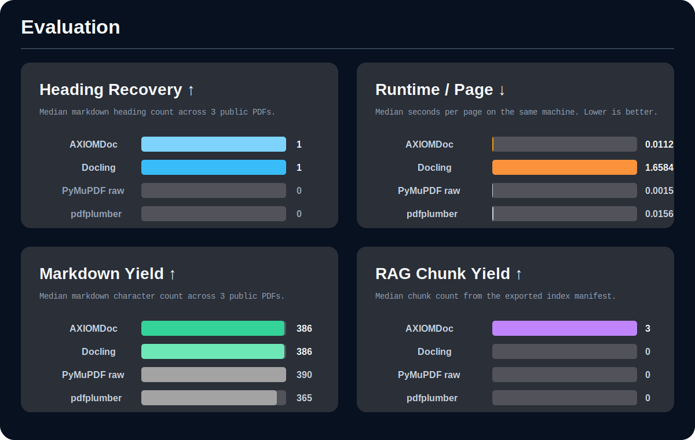

# AXIOMDoc


`AXIOM` stands for `Any-document eXtraction, Indexing, and Ontology Mapping`.

AXIOMDoc is an open-source Python library for document intelligence in RAG pipelines. It is being built to ingest heterogeneous documents, preserve structure, export canonical XML and Markdown, and generate retrieval-ready indexing artifacts with provenance.

## What AXIOMDoc is for

- Converting PDFs, XML, DOCX, DOC, XLSX, HTML, and related formats into one canonical document model.
- Preserving headings, reading order, page anchors, metadata, and layout evidence.
- Exporting clean XML and Markdown representations for downstream processing.
- Building chunk, section, and field-level artifacts for retrieval and context mapping.

## Core requirements

1. Any-document ingestion across common enterprise and knowledge-document formats.
2. Structure fidelity so headings are not missed and body text is not promoted into headings.
3. Canonical export into XML, Markdown, JSON, and retrieval artifacts from one internal schema.
4. RAG-first indexing with chunk provenance, section paths, and page references.
5. XML-safe serialization that strips characters invalid under XML 1.0.

## Architecture

AXIOMDoc follows a canonical-document-model approach:

- Parser backends normalize source files into one schema.
- Exporters transform that schema into XML, Markdown, and other artifacts.
- Index builders create retrieval-ready records with explicit provenance.
- Enrichment passes can later add headings, entities, forms, tables, and citation anchors.

This keeps parsing separate from retrieval and avoids binding the project to one vendor model or one OCR stack.

## Current package layout

```text
src/axiomdoc/
  cli.py
  pipeline.py
  models.py
  indexing.py
  exporters/
    xml.py
    markdown.py
  parsers/
    base.py
    registry.py
    pdf.py
    xml.py
docs/
  architecture.md
assets/
  axiomdoc-logo.svg
```

## Install

```bash
python3 -m pip install -e .
```

## Example

```bash
axiomdoc parse ./sample.pdf --xml-out ./sample.xml --markdown-out ./sample.md --index-out ./sample.index.json
```

## Evaluation



The comparison above is now populated from a runnable benchmark harness in [benchmarks/run_benchmarks.py](/Users/meetjethwa/Development/RagPrep/DocIntelligence/benchmarks/run_benchmarks.py). This is still an operational benchmark, not a full scientific benchmark with human labels, so the metrics are limited to things we can measure honestly and reproduce today.

Comparison set used in this run:

- AXIOMDoc
- Docling
- PyMuPDF raw extraction baseline
- pdfplumber

Public PDF corpus used in this run:

- `attention-is-all-you-need.pdf`
- `orimi-test.pdf`
- `w3c-dummy.pdf`

Measured results from the current run:

| Library | Success Rate | Median Sec/Page | XML Well-Formed Rate | Median Heading Count | Median Markdown Chars | Median Chunk Count |
| --- | ---: | ---: | ---: | ---: | ---: | ---: |
| AXIOMDoc | 1.00 | 0.0112 | 1.00 | 1 | 386 | 3 |
| Docling | 1.00 | 1.6584 | 1.00 | 1 | 386 | 0 |
| PyMuPDF raw | 1.00 | 0.0015 | 1.00 | 0 | 390 | 0 |
| pdfplumber | 1.00 | 0.0156 | 1.00 | 0 | 365 | 0 |

Interpretation:

- AXIOMDoc is substantially slower than raw PyMuPDF because it does structural classification and builds XML, Markdown, and chunk manifests.
- AXIOMDoc is much faster than Docling on this small corpus while still emitting RAG-ready chunks.
- Docling and AXIOMDoc both recovered markdown headings on the median document in this dataset.
- All evaluated libraries produced well-formed XML in this benchmark because the wrapper export path enforced XML-safe serialization.
- AXIOMDoc is the only library in this comparison currently producing a non-zero chunk manifest because the benchmark used each tool's default or near-default extraction path.

Benchmark files:

- [benchmarks/results/latest.json](/Users/meetjethwa/Development/RagPrep/DocIntelligence/benchmarks/results/latest.json)
- [benchmarks/results/docling.json](/Users/meetjethwa/Development/RagPrep/DocIntelligence/benchmarks/results/docling.json)

Benchmark command:

```bash
.venv/bin/python benchmarks/run_benchmarks.py --dataset-dir benchmarks/datasets/pdfs --libraries axiomdoc pymupdf_raw pdfplumber --output benchmarks/results/latest.json
.venv/bin/python benchmarks/run_benchmarks.py --dataset-dir benchmarks/datasets/pdfs --libraries docling --output benchmarks/results/docling.json
```

Limits of this benchmark:

- This is PDF-only right now. DOCX, XLSX, and XML are not included yet.
- Heading recovery here is markdown heading count, not labeled precision/recall.
- Markdown character count is a yield proxy, not a semantic quality score.
- The dataset is small and should be expanded before making stronger claims.

## XML safety

XML does not allow certain control and surrogate characters. AXIOMDoc now sanitizes invalid XML 1.0 characters before serialization in [src/axiomdoc/exporters/xml.py](/Users/meetjethwa/Development/RagPrep/DocIntelligence/src/axiomdoc/exporters/xml.py), so malformed text content does not break XML generation.

## Status

The project is in the initial library phase. The baseline PDF and XML paths exist, and the roadmap for richer DOCX, XLSX, OCR, table extraction, and PageIndex-style indexing is documented in [docs/architecture.md](/Users/meetjethwa/Development/RagPrep/DocIntelligence/docs/architecture.md).
